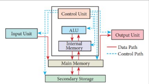
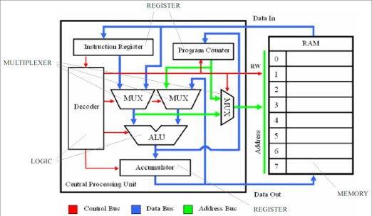
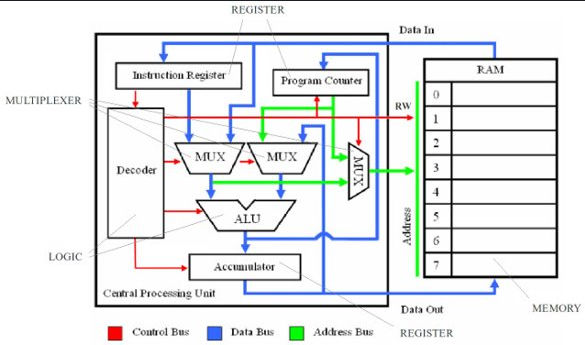
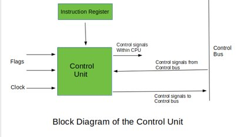

# CPU

## Common CPU components

1.  Input Unit
2.  Central Processing Unit (CPU)
    a) Control Unit (CU)
    b) Arithmetic Logic Unit (ALU)
    c) Internal Memory (Registry and Cache)
3.  Memory Unit
4.  Output Unit

## ALU, Control Unit and Registers

### ALU

The ALU is the part of the CPU that can perform arithmetic and logic operation onto binary numbers.

An ALU has three parallel data buses, this consists of 2 inputs opperand (A and B) and the third which is the resulting output (A basic form of this is like a logic gate)

* * *

### CU

The CU controls the operation of the processor.

- It obtains the instructions from the memory, interprets them, and directs the operation of the computer.
- It is responsible for controlling the transfer of data and instructions among other units of a computer
- It communicates with Input/Output devices for transfer of data or results from storage.
- It does not process or store data.

* * *

### Registers

Registers are small amounts of high-speed memory contained within the CPU. They are used by the processor to store small amounts of data that are needed during procesing, such as:

- The address of the next instruction to be executed
- The current instruction being decoded
- The result of calculations

Some examples of Registers are

- ***P***rogram ***C***ounter (***PC***),
- ***I***nstruction ***R***egister (***IR***),
- ***M***emory ***A***ddress ***R***egister (***MAR***),
- ***M***emory ***D***ata ***R***egister (***MDR***)

* * *

## CPU speed

### Clock Speed

A 'CPU clock cycle' is a synchronised pulse thorugh the computer.
During each cycle/pulse, billions of transistors withing the processor will open and close. Somtimes, multiple instructions can be completed each clock cycle however at the same time sometimes an instruction can take multiple clock cycles.

In general, a higher clock speed means a faster CPU. The clock speed measures the number of cycles your CPU executes per second, measured in GHz

### Cache

Cache is a small amount of ***R***andom ***A***ccess ***M***emory (***RAM***) that is built directly within the processor. 
As it is built directly into the processor this means that it is faster to access and therefore the data/instructions can be read and used more efficently.
As there is only a small amount it is used to hold data/instructions that are more likely to be used.
This allows for faster processing as the processor does not need to wait for the data/instructions to be fetched from RAM.

There are different levels of cache in a CPU:

- Level 1:
	- Also named primary cache
	- Is the fastest and is embedded in the Processor chip as CPU cache
	- Has the least amount of storage

- Level 2:
	- Also names secondary cache
	- Can be embedded in the CPU or as a co-processor or a seperate chip
	- Has a high-speed bus connecting the cahce and CPU so it does not get slowed down by traffic on the main system

- Level 3:
	- Specalised memory to improve the performance of L1 and L2 cache
	- Ussually double the speed of DRAM
	- With multi-core processors, each core can have dedicated L1 and L2 cache, but can share L3 cache 
	- If a L3 cache refernces an instruction, it is ussually elevated to a higher level of cache
