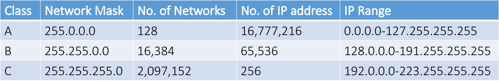
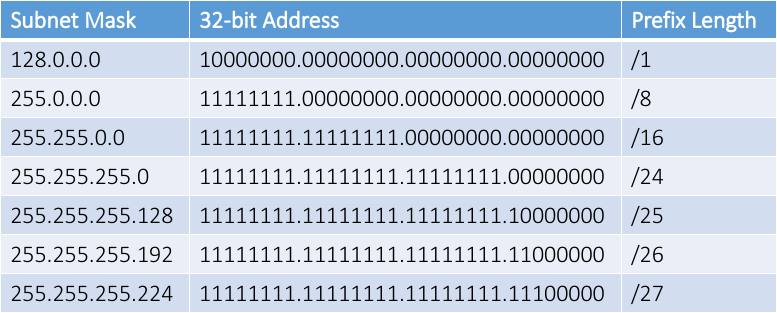
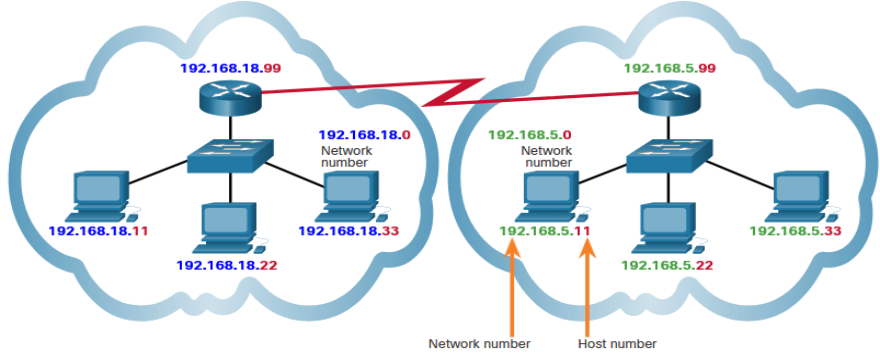
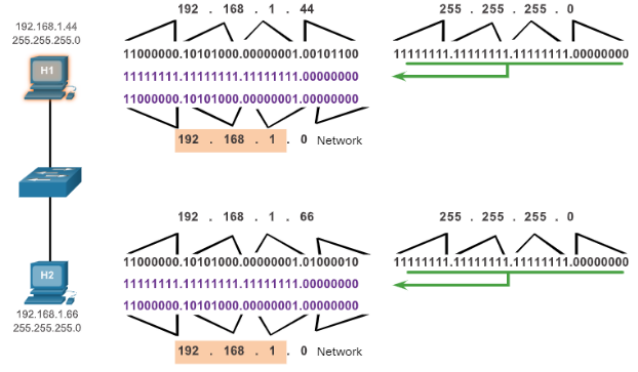
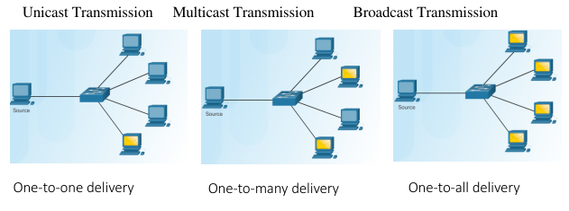

# Network addresses

## Internet Protocol version 4 (IPv4)

The IPv4 address is a logical network address that identifies a particular host. 
Must be properly configured and unique within the LAN and world
Network devices (e.g.: Router, Access Point) interfaces that provide connections to an IP network will also have an IPv4 address.
	Does switch/hub have IP address?

Every packet sent across the internet has a source and destination IPv4 address. 
Required by networking devices to ensure the information gets to the destination and any replies are returned to the source

IPv4 addresses can be assigned either [statically](#static-ipv4) or [dynamically](#dynamic-ipv4)

### Notation of IPv4

For IPv4 there are 4 groups of numbers sperated by a period (.).

Each value being from 0 to 255 in binary
e.g.
192.168.5.1

### Static IPv4

With a static assignment, the host IPv4 address must be configured manually, together with subnet mask, default gateway, and DNS server address.

Static addresses are typically assigned for printers, servers, and other networking devices that need to retain a fixed IP address to provide services.

Static assignment can be time consuming to implement. It is prone to errors because manual configuration is required.

### Dynamic IPv4

IPv4 addresses can be dynamically assigned to end devices through an application protocol know as **D**ynamic **H**ost **C**onfiguration **P**rotocol (**DHCP**)

DHCP automatically assigns addressing information such as IPv4 address, subnet mask, default gateway, and other configuration information.

Benefits of using DHCP:
- Reduces the burden on network support staff and virtually eliminates entry errors.
- A dynamic IP address is not permanently assigned to a host but is only leased for a period of time.

### IPv4 Structure
The logical 32-bit IPv4 address is hierarchical and is made up of two parts, the network and the host. 

Example:
IPv4 address: 192.168.5.11
Subnet Mask: 255.255.255.0

Subnet Mask(binary):  11111111. 11111111. 11111111. 00000000
IPv4 address(binary): 11000000.10101000.00000101.00001011

### Assignment of IPv4 Addresses
For a company or organization to support network hosts that are accessible from the internet, such as web servers, that organization must have a block of public addresses assigned. 

Public IPv4 and IPv6 addresses are regulated and allocated to each organization separately. These public addresses must be unique and not repeated in their use across the world.

Both IPv4 and IPv6 addresses are managed by the Internet Assigned Numbers Authority (IANA). 
- The IANA manages and allocates blocks of IP addresses to the Regional Internet Registries (RIRs). 
- RIRs are responsible for allocating IP addresses to ISPs, who in turn provide IPv4 address blocks to organizations and smaller ISPs. 
- Organizations can get their addresses directly from an RIR subject to the policies of that RIR.

## DHCP

A device can be a DHCP server if it is running the DHCP service software

DHCPv4 servers are typically connected to a LAN because it uses broadcast. DHCPv4 servers deploed outside of a LAN will require relay service.

In a home network or SOHO, a wireless router provides DHCP to end devices. It is also a DHCP client to get IPv4 address from ISP.

### DHCPv4 Operation

When a host is configured using DHCP, it will try to obtain an  IPv4 address, subnet mask, default gateway, and DNS server from a DHCP. 

1. The client sends a DHCPDISCOVER message using broadcast.
2. A DHCP server responds with a DHCPOFFER message with a set of IPv4 addressing information.
3. The client then sends a DHCPREQUEST message to request the use of IPv4 addressing information offered by the DHCP server.
4. The DHCP server responds with a DHCPACK message to grant the request from the client.

### DHCP Service Configuration

To configure a home wireless router, access its graphical web interface by opening the browser and entering the router default IPv4 address: 192.168.0.1 in the IP Address field.

The IPv4 address of 192.168.0.1 and subnet mask of 255.255.255.0 are the defaults for the internal router interface. This is the default gateway for all hosts on the local network. Ensure the DHCP server is enabled.

Specify the DHCP IPv4 address range with a starting address (do not use 192.168.0.1 because the router is assigned this address) and the number of addresses to be assigned.

## Network Address Management

The information that should be put into network documentation for network address management is:

- Device Name
- MAC Address
- IP Address
- DHCP Range (To specifiy which IP addresses are in the pool that new devices can connect too)

### Classful Addressing

The first 8bits of IP address are used to define a network. This would limiting the internet to just 254 networks. Each network contained 16,777,216 different IP addresses. 

In 1981, Classful addressing came along to help solve that problem. With classful addresses, we went from just 254 available networks to 2,113,664 available networks.

### Classless addressing

In 1993, as Classless Inter-Domain Routing (CIDR) introducing the concept of classless addressing. Classless addressing with variable-length subnet masking (VLSM) can allocate IP address more efficiently.

## Networks and Hosts

Multiple logical networks can exist on one physical network, if the network portion of the logical network host addresses is different.

The network portion indicates the network on which each unique host address is located. Routers only need to know how to reach each network, rather than needing to know the location of each individual host.

### How to Calculate Number of Hosts

A subnet mask of 255.255.255.0 (decimal) or 11111111.11111111.1111111.00000000 (binary) uses 24 network bits and 8 host bits.

To determine how many hosts can be on that network, take the number 2 to the power of the number of host bits (2^8 = 256). 
Subtract 2 (256-2) for numbers that cannot be used
- Broadcast address of all 1s in the host portion
- Network ID of all 0s

## Transmission

### Transmission Options

A unicast transmission is used for normal host-to-host communication

### Broadcast Transmission

Broadcast packets are sent to all hosts in the network using a broadcast address. 
A broadcast packet contains a destination IPv4 address with all ones (1s) in the host portion. 
All hosts on that local network (broadcast domain) will receive and look at the packet. 
When a host receives a broadcast packet, the host processes the packet as it would a packet addressed to its unicast address.

### Multicast Transmission

Multicast transmission reduces traffic by allowing a host to send a single packet to a selected set of hosts that subscribe to a multicast group.
IPv4 has reserved the 224.0.0.0 to 239.255.255.255 addresses as a multicast range. 
The IPv4 multicast addresses 224.0.0.0 to 224.0.0.255 are reserved for multicasting on the local network only. 
A router connected to the local network will not forward them further.

## Components of a Home Network

In addition to an integrated router, there are many different types of devices that might be connecting to a home network. Examples include:
- Desktop computers
- Gaming systems
- Smart TV systems
- Printers
- Scanners
- Security cameras
- Telephones
- Climate control devices

### Building a Home network

Wireless technology enables networks to be easily expanded, without the limitations of cabled connections. 

One of the main advantages of wireless is the ability to provide anytime, anywhere connectivity.

Wireless technology is fairly easy and inexpensive to install. New and visiting users can join the network quickly and easily.

#### Typical Home Network Routers

Small business and home routers typically have two primary types of ports:

Ethernet Ports - Usually labeled “Ethernet” or “LAN”, these ports connect to the internal switch portion of the router.  
Internet Port - Used to connect the device to another network such as the internet through a cable or DSL modem.

Many home routers include a radio antenna and a built-in wireless access point.

## Wi-Fi

### Wireless standards

The main organization responsible for the creation of wireless technical standards is the IEEE.

The IEEE 802.11 standard governs the WLAN environment. 

Wireless standards for LANs use the 2.4 GHz and 5 GHz frequency bands. Also known as Wi-Fi.

Another organization, known as the Wi-Fi Alliance, is responsible for testing wireless LAN devices from different manufacturers. 

Wireless standards are constantly improving the connectivity and speed of Wi-Fi networks.

### Wireless Settings

Network mode - Determines the type of technology that must be supported. For example, 802.11b, 802.11g, 802.11n or Mixed Mode.

Network Name (SSID) - To identify the WLAN.

Standard Channel - Specifies the channel over which communication will occur. By default, this is set to Auto to allow the AP to determine the optimum channel to use.

SSID Broadcast - Determines if the SSID will be broadcast to all devices within range. By default, set to Enabled.

### Wireless Traffic Controls

WiFi channels are smaller bands within WiFi frequency bands. Each channel is capable of carrying a different conversation.

Multiple APs can function in close proximity as long as they use different channels for communication.

Some 5 GHz wireless technologies combine multiple channels to create a single wide channel, which provides more bandwidth and increases the data rate.

