# Network components

## Components

The network infrastrucute contains three categories of hardware components:

- End Devices
- Network devices / Intermediate devices
- Network media

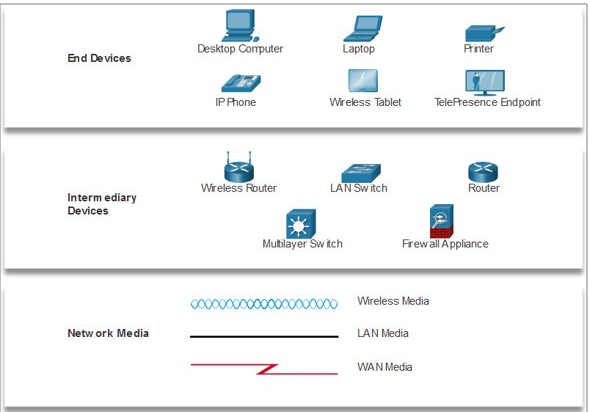

## Encapsulation

Each message is encapsulated into a specific format, called a frame, that includes the source and destination addresses.

- An example of encapsulation is how a letter is put inside an envelope

For communication on an IP network, the format is very specific and includes a source and destination address.

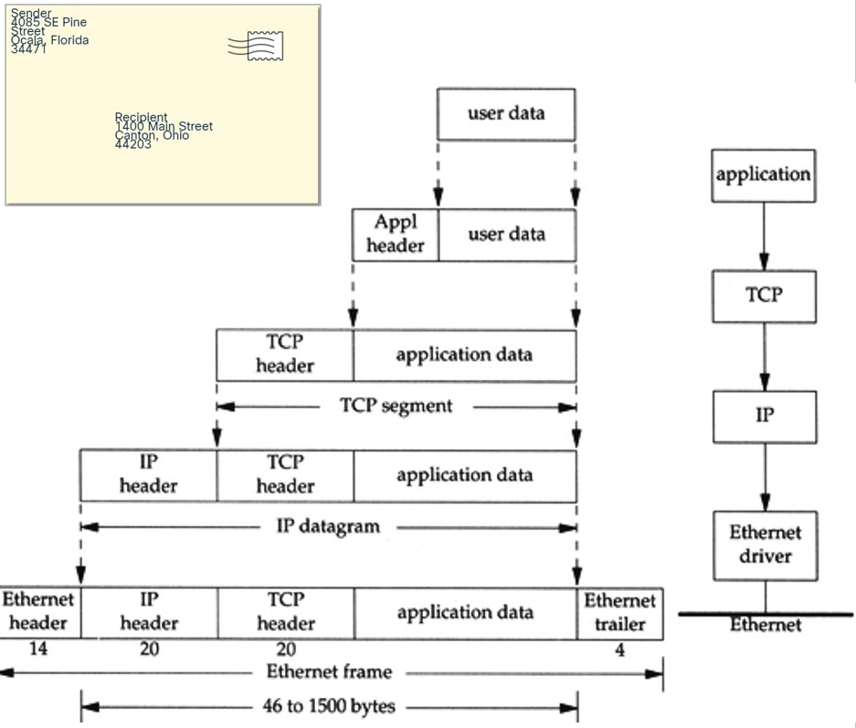

## Ethernet Frame

On an Ethernet network, messages are put into a frame or Layer 2 protocol data units (PDUs)

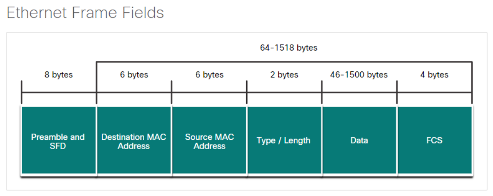

Jumbo frames are Ethernet frames with more than 1500 bytes of payload, the limit set by the IEEE 802.3 standard. Commonly, jumbo frames can carry up to 9000 bytes of payload. Jumbo frames can increase the efficiency of Ethernet and network processing in hosts by reducing the protocol overhead.

However an issue with Jumbo frames is that the data could get interrupted easier or corrupted which means the jumbo frame might have to be resent which takes longer.

## Sending data

For a device to communicate on a network a physical address and logical address are needed for a device to communicate on an Ethernet network.

- A physical address (Also named a MAC address) does not change
- A logical address (IP address) can changed and is commonly assigned by a network administrator.
    - 2 parts: network and host

## End Device Addressing

To physically connect to a network, an end-user device must have a **N**etwork **I**nterface **C**ard (**NIC**)
Some configuration of the OS so that the device can participate in the network.
There are three parts to the IP configuration which must be correct for the device to send and receive information on the network.

1.  IP address
    - This identifies the host on a network
2.  Subnet masks
    - This is used to identify the network on which the host is connected
3.  Default gateway
    - This identifies the networking device

## Broadcast Domain

A broadcast message is used to contact every device on a local network.
An Ethernet broadcast is all 1s in the destination MAC address - FFFF.FFFF.FFFF

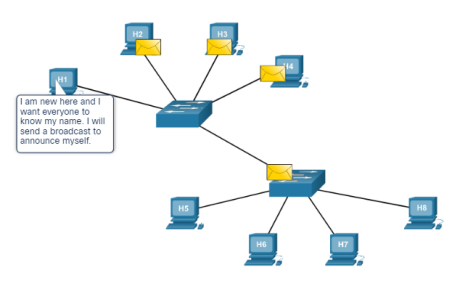

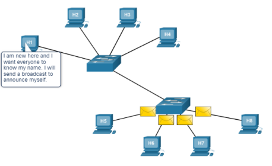

A broadcast domain is the area through which a broadcast message can travel.

Each local Ethernet is a broadcast domain,

Routers are used to divide the network into multiple broadcast domains.

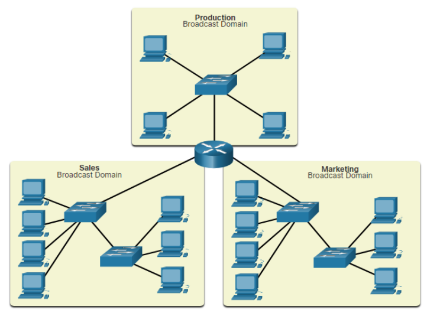

## Access Layer Communication

In order to send information from a device that is on an Ethernet network, the device must ssupply its own source MAC address, a destination MAC address, its own source IP address, as well as a destination IP address.

The **A**dress **R**esolution **P**rotocol (**ARP**) is used to discover the MAC address of a device on the same local network.

## ARP

ARP uses 3 steps to discover and store the MAC address of a host on the local network when only the IPv4 address of that host is known.

1.  The sending host creates and sends a frame addressed to a broadcast MAC address. Contained in the frae is a message with the IPv4 address of the intended destination host
2.  Each host on the network recieves the broadcast frame and compares the IPv4 address contained in the message with its own IPv4 address. The host with the matching IPv4 address sends its own MAC address back to the original sending host.
3.  The sending host receives the message and stores the MAC address and the IPv4 address in an ARP table.

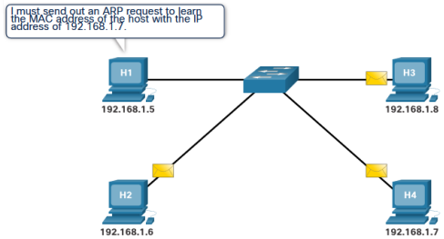

## Dividing the Local Network

### Broadcast Containment

Routers in the distribution layer can limit broadcasts to the local network where they need to be heard. Although broadcasts are necessary, too many hosts connected on the same local network can generate excessive broadcast traffic and slow down the network.

### Security

It also can separate and protect certain groups of computers where confidential information resides. Routers can also hide the addresses of internal computers from the outside world to help prevent attacks, and control who can get into or out of the local network.

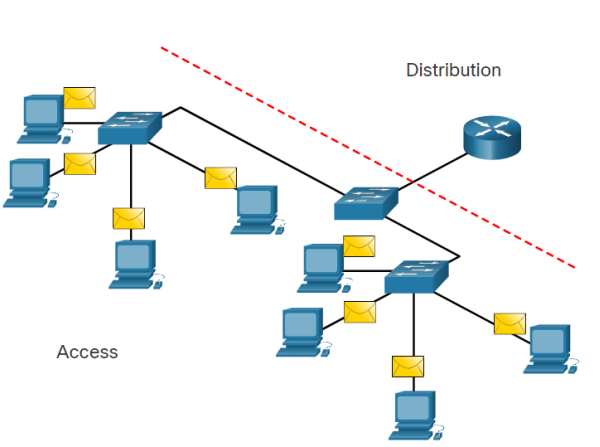

### Location

Routers in the distribution layer canbe used to interconnect local networks at various loxations of an organisation that are geographically seperated

### Logical grouping

Routers in the distribution layer can be used to logically group users, such as departments within a company, who have common needs or for access to resources.

## Routing

### Routing Path Selection

- Each router interface connects to a different network.
- A routing table contains information for how to reach local and remote networks
- The destination IP address is used and compared with the networks in the routing table to determine the interface to forward the packet out of.
- **Routers do not forward broadcast messages**

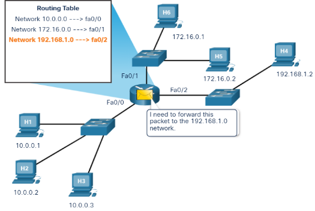
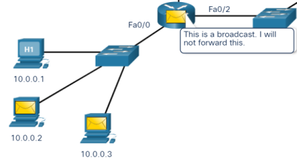

### Packet forwarding

The destination MAC address is used to forward the packet to either the router if the destination IP address is for a different network or a specific network device on the local network.
The ARP table shows a mapping of IP address to MAC address
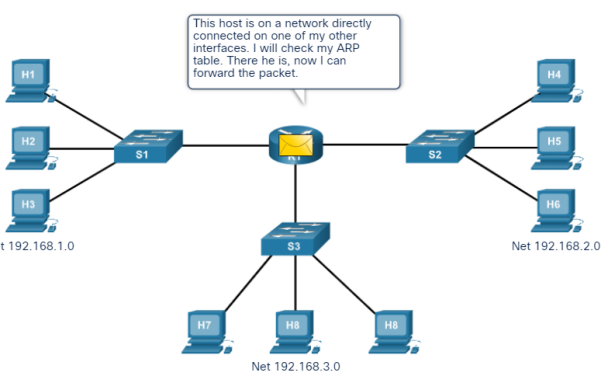

### Routing Table Entries

A routing table contains network addresses and the best path to reach a network
Two ways routes can be added to a routing table are:

1.  Dynamically learned from other routers
2.  Manually entered by a network Admin
    A default route is the router interface used when forwarding packets to a destination that is not in the routing table.
    If a packet is destined for a network that is not in the routing table and no default route exits, the packet will be dropped.

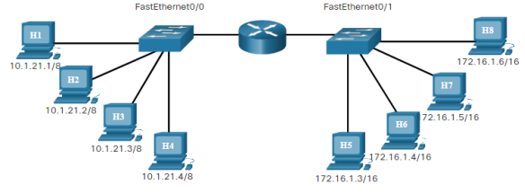

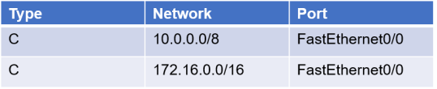

## The Default Gateway

When a host sends a message to a device on the same network, it forwards the message directly and uses ARP to discover the MAC address.
When a host sends a message to a device on a remote network, the hosts uses the MAC address of the router as the destination, but still has the IP address of the remote host as the Layer 3 destination.
It is very important that each host has the correct default gateway that is the IP address of the router on the same network.
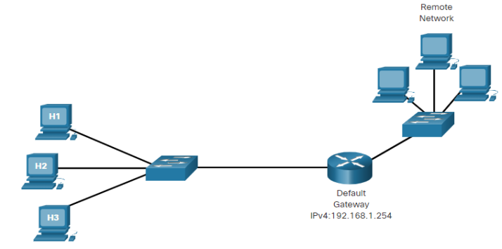
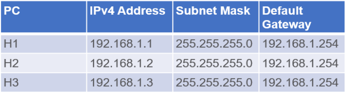

## Local and Remote Network Segments

### Advantages of a single local segment:

- Appropriate for simpler networks
- Less complexity and lower network cost
- Allows devices to be "seen" by other devices
- Faster data transfer - more direct communication
- Ease of device access

### Disadvantages of a single local segment:

- All hosts are in one broadcast domain which causes more traffic on the segment and may slow network performance
- Harder to implement QoS
- Harder to implement security

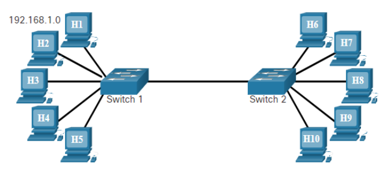

### Advantages of having hosts on a remote segment

- More appropriate for larger, more complex networks
- Splits up broadcast domains and decreases traffic
- Can improve performance on each segment
- Makes the machines invisible to those on other local network segments
- Can provide increased security
- Can improve network organization

### Disadvantages of having hosts on a remote segment

- Requires the use of routing (distribution layer)
- Router can slow traffic between segments
- More complexity and expense (requires a router)

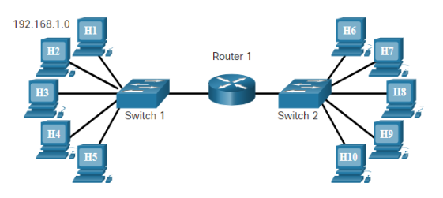

## Benefits of a Hierarchical Design

A hierarchical, layered design provides:

- Increased efficiency
- Optimization of function
- Increased speed
- A way in which to scale the network without impacting the performance of existing ones

Three layers:

1.  Access Layer - This layer provides connections to hosts in a local Ethernet network.
2.  Distribution Layer - This layer interconnects the smaller local networks.
3.  Core Layer - This layer provides a high-speed connection between distribution layer devices.

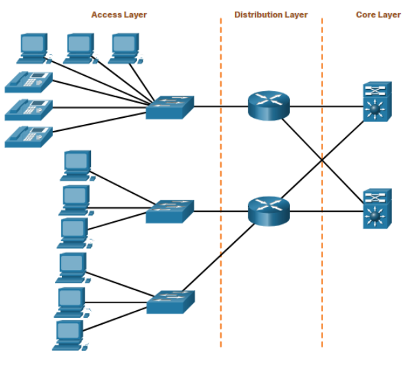

## The MAC Address Table

A switch builds a MAC address table by examining a frame as it comes into the switch.
A switch adds the source MAC address of the device connected to the port through which the frame came in on.
A switch forwards a frame out to a specific port when the destination MAC address is in the MAC address table.
A switch forwards a frame out to all hosts (except the sending host) when the destination MAC address is not in the MAC address table.

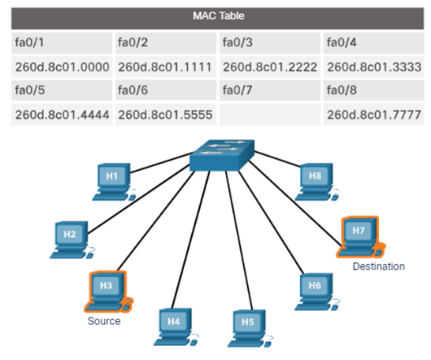

## Standard Network Switch

A standard switch receive a broadcast message from any port will send the broadcast to all other ports.
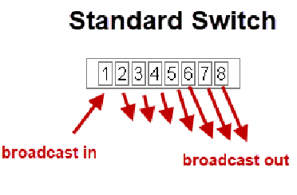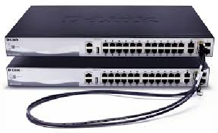

Devices attached to same switch can communicate with each other.
Switch stacking can provide more ports for connection (up to 300+).

## Virtual LAN

Virtual LANS is a technology that allows you to split a network into segments using switches.
A VLAN capable switch is possible to restrict broadcasts and to control which devices can communicate with each other.
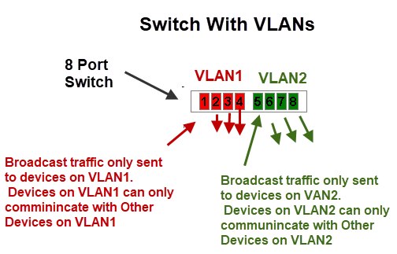

A Switch which supports VLANs will also include the VLAN ID (1-1005, extend up to 4094) for each entry of the MAC Address Table.

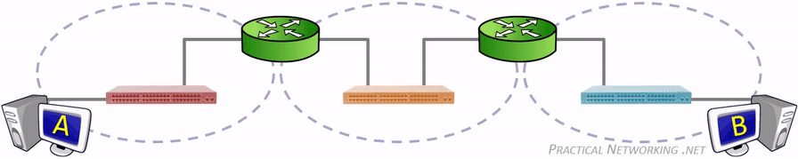
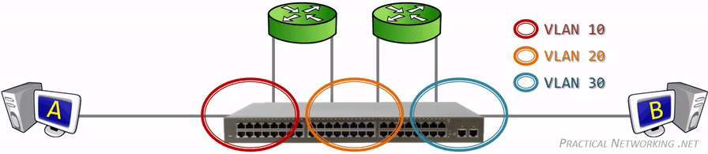

Any switch port which is not explicitly assigned a VLAN number, resides in the default VLAN. Which for most vendors corresponds to VLAN 1.

Traffic arriving on a switch port assigned to one VLAN will only ever be forwarded out another switch port that belongs to the same VLAN – a switch will never allow traffic to cross a VLAN boundary. Again, each VLAN operates as if it were a completely separate physical switch.

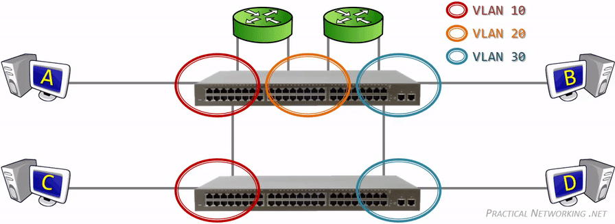

Each connected switch port in the topology above is a member of only a single VLAN (an Access port). In order to extend a VLAN to the second switch, a connection is made between one Access port on both switches for each VLAN. There is a mechanism which allows a single switch port to carry traffic from multiple VLANs (a Trunk port). A tag(802.1Q) is added to the sending frames to indicate to the other end what VLAN that frame belongs to.

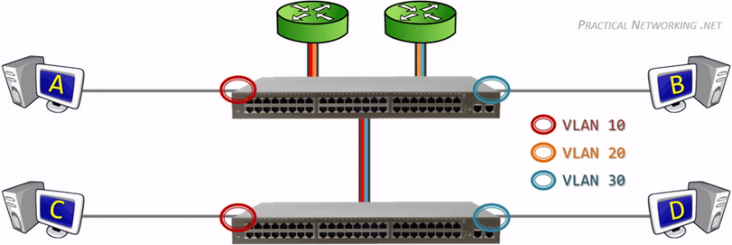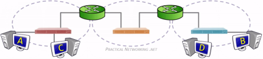

### Native trunk port
What will happen if an untagged frame somehow gets into the trunk link? 

Without the tag, the switch will not know what VLAN the traffic belongs to, therefore the switch associates the untagged traffic with what is configured as the Native VLAN. Essentially, the Native VLAN is the VLAN that any received untagged traffic gets assigned to on a Trunk port.

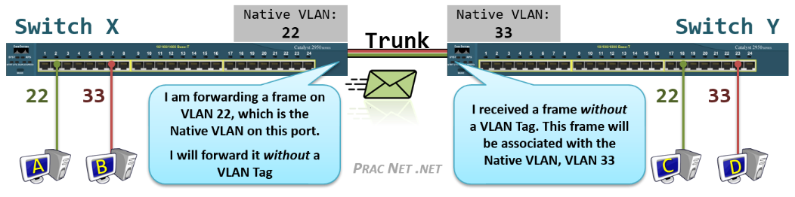

Native VLAN is configured per trunk port, it is locally significant and it tells the switch - "if you receive an untagged data into this port, forward it like it is part of the native VLAN number".

By default, the native VLAN of all trunk ports on switches is assigned to VLAN 1 but it can be any valid VLAN number.

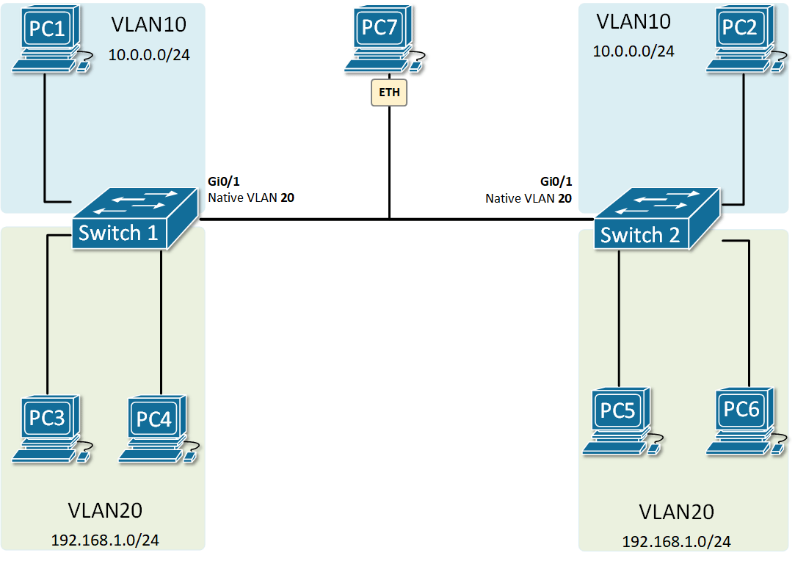

The switches are not only putting the received untagged data into the native VLAN, but they are also sending the data in the Native VLAN untagged.
VLAN20 is the Native VLAN of the trunk port. All control plane messages such as CDP, VTP, and DTP are also sent through the Native VLAN i.e untagged.
 
 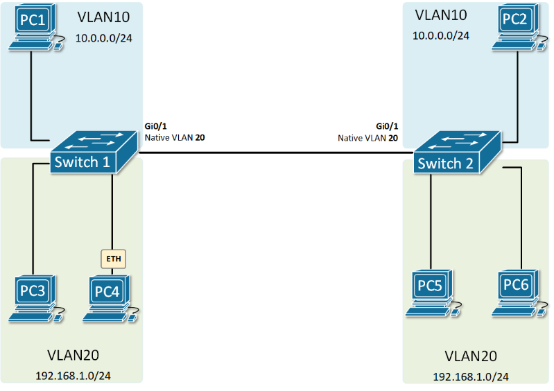
 
 
